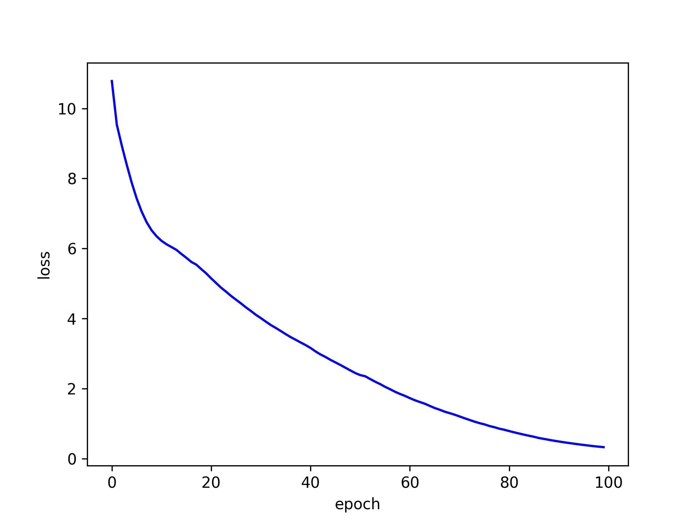

# GPT2
> author: 
> 辛洲 24212020200
> 陈宇康 24212020060
## 模型简介
模型仿照GPT2结构，词表为50257，词向量维度为768。使用加速实现的Attention后端，共含有12个Transformer block，其中Attention Block的Multi Head数为12，并采用正弦位置编码。

tokenizer使用GPT2中tokenizer

## 模型准备
dataset: 'roneneldan/TinyStories'子集

train_dataset: 300条句子

test_dataset:  100条句子


## 模型训练
训练模块采用自回归训练方式，对数据集分epoch进行训练，每个batch_size为64，通过并行计算方式降低时间成本。在100个epoch后模型Loss从10降至约0.3。

## 训练结果



上图为训练时loss变化曲线，采用交叉熵对每个epoch分别计算Loss,在100个epcoh训练后结果可达0.3左右。

使用如下提示词检验训练效果，自回归生成句子：
```python
  ["he", "I", "She", "The dog", "My mom", "I love", "We had", "He is", "The dpg", "My favorite"],
```

生成结果如下：
> 1. he was walking in the forest. Suddenly, he saw something strange to a closer look. He wanted to help what it! The sun was a bit scared
> 
>2. I were in the garden. The sun was very happy and the garden.
>Molly looked up on the sun was shining. The little girl
>3. She was very excited. "M playing with her mom in the garden. It's a big, but the little girl called out to play with her mom
> 
>4. The dog little girl called and her mom were walking in the park. She loved to run and play on the park. One day, the park, sweet and
> 
>5. My mom and her were walking in the park. Suddenly they saw a beautiful little girl. She was full of her mommy when they heard it was.
> 
>6. I love an old man. He ran to the old around with him. It was looking around something strange man from the ball around.
>Suddenly, Jack
> 
>7. We had was a little girl in the forest. She was very excited and as she could feel her mommy. Her mommy was very excited and the little
> 
>8. He is was a little girl in the grass. It had a big and it in the little girl. The little girl was her black girl loved it was her
> 
>9. The dpg were two friends with his dad. The windows was playing with the garden. It was playing with the little girl picked it in the little room and it
> 
>10. My favorite and his were in the park. Suddenly, they saw a tree near the tree near the tree. The little girl was her mom. The little girl